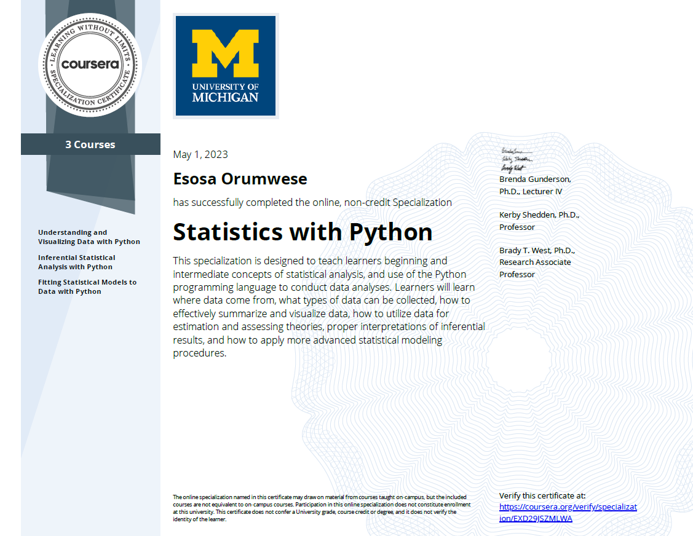

# Statistics-with-Python

This repo contains coursework done while on the [Statistics with Python Specialization handled by Coursera.](https://www.coursera.org/specializations/statistics-with-python)
* Course 1: Understanding and Visualizing Data with Python
* Course 2: Inferential Statistical Analysis with Python
* Course 3: Fitting Statistical Models to Data with Python

